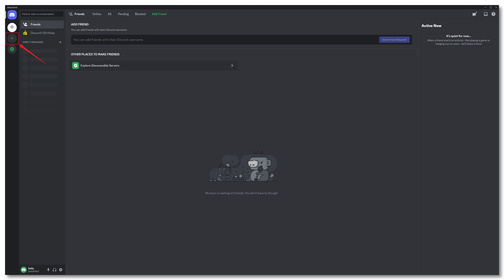
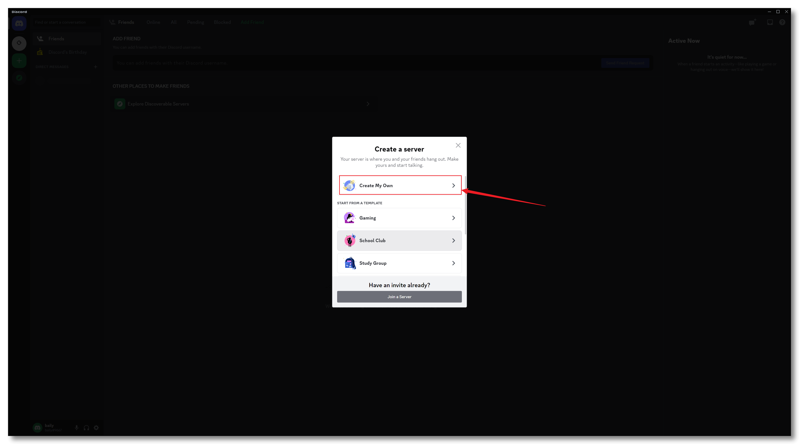
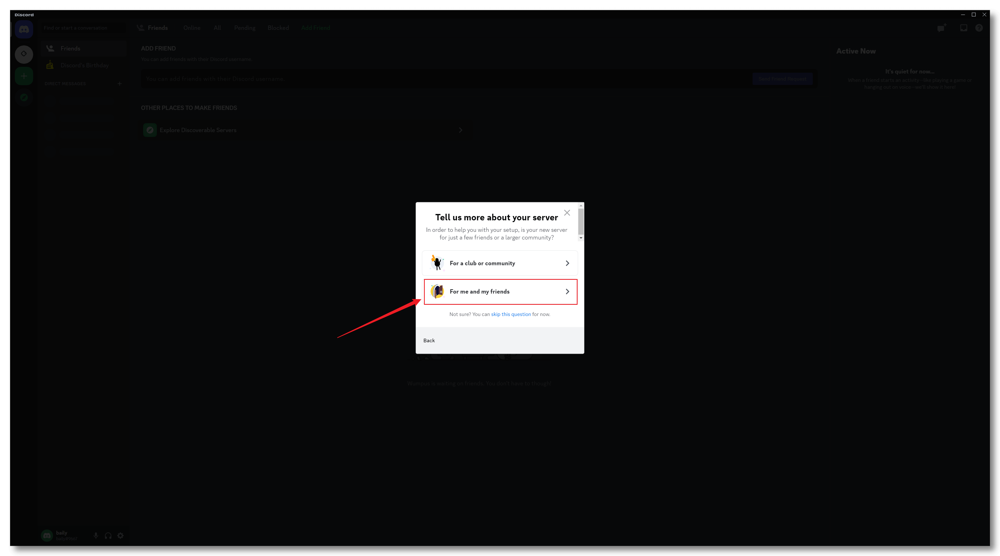
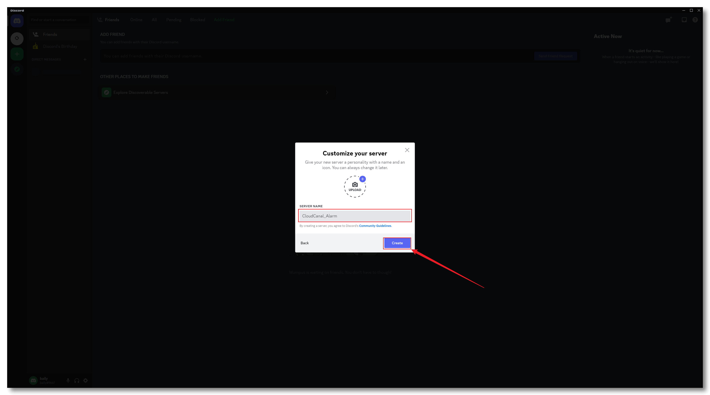
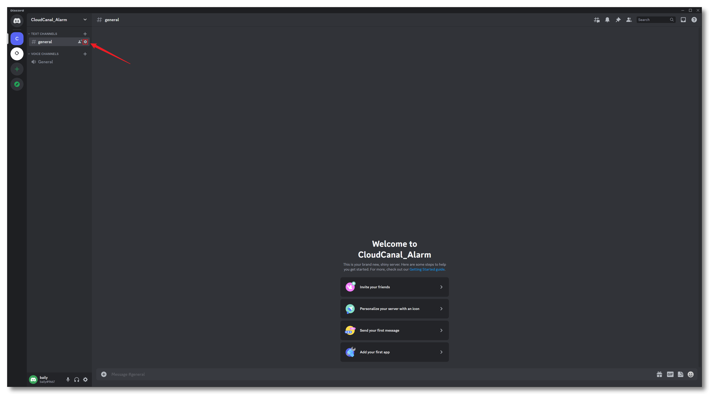
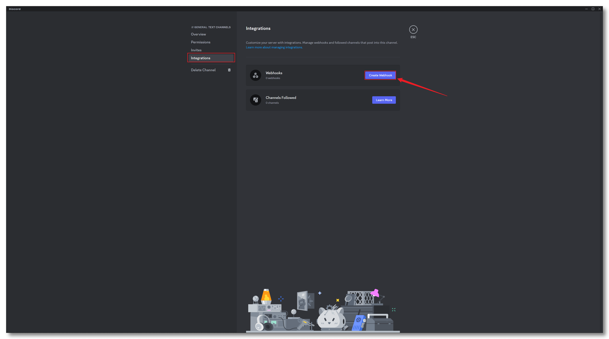
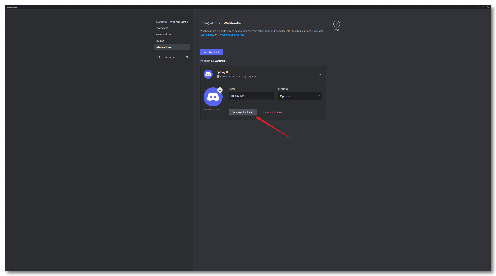
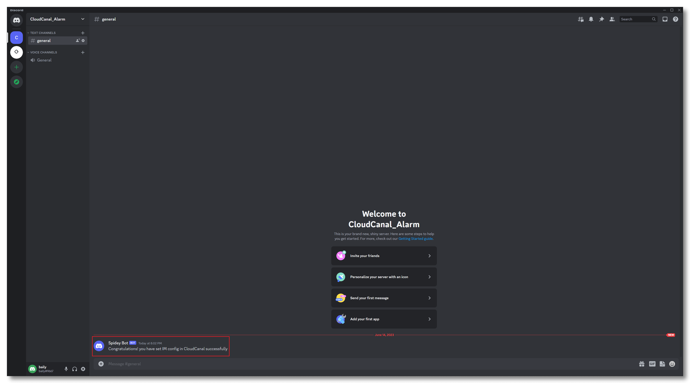

BladePipe integrates with Discord servers by configuring the webhook to send alert messages to specified Discord channels. This document provides a brief introduction on how to obtain a valid webhook for use.

### Install Discord

- [Install Discord](https://discord.com) and install it. Skip if already installed.
- Register or log in. Skip if already logged in.

### Configure Discord 

- Create a server

  

  
  
   
  
  

- Configure WebHook

  

  

- Obtain the webhook

  

### Success

- After the Discord alert group is successfully created, and the Discord webhook is filled in the BladePipe **User Avatar**>**Account**>**User Setting**, subsequent BladePipe DataJob alerts will be sent to this group.

    
