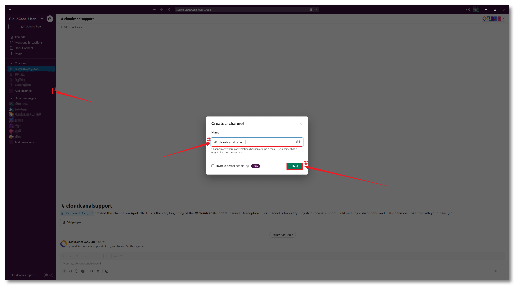
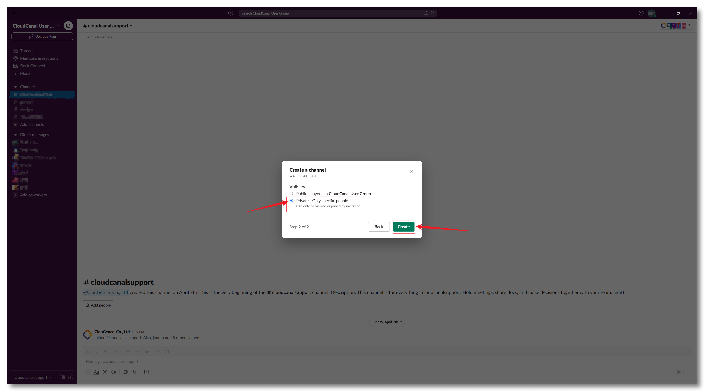
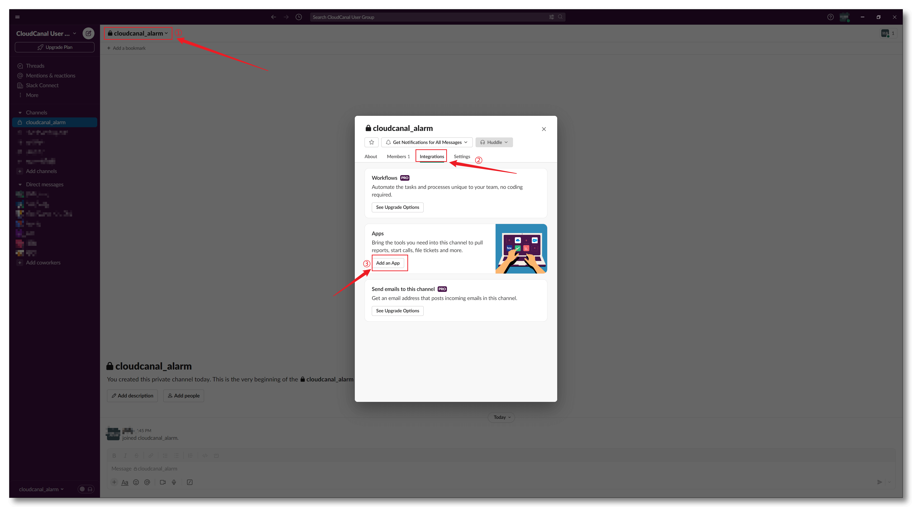
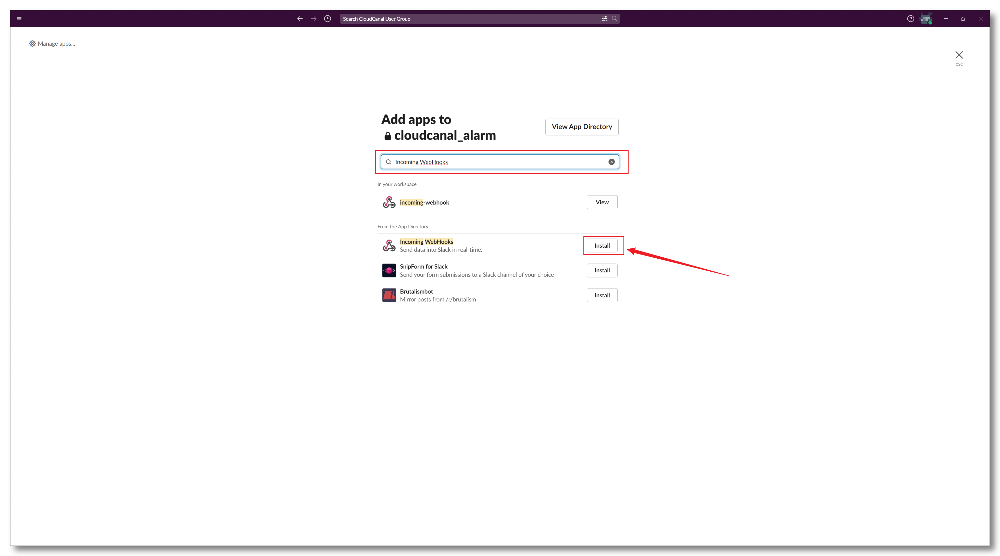
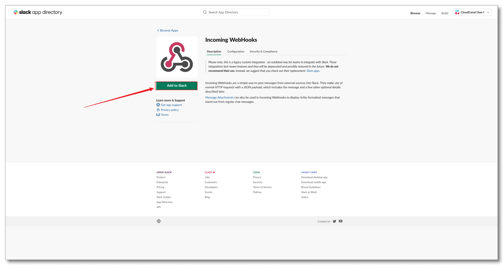
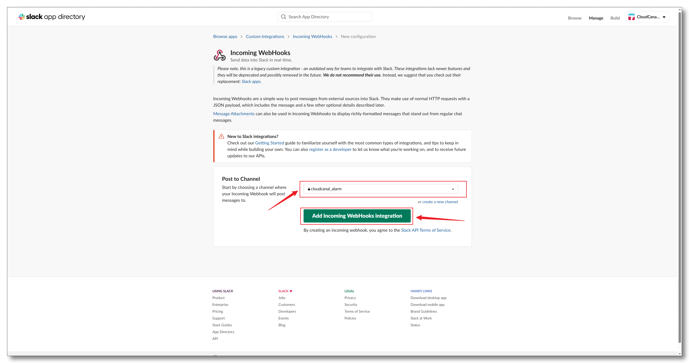
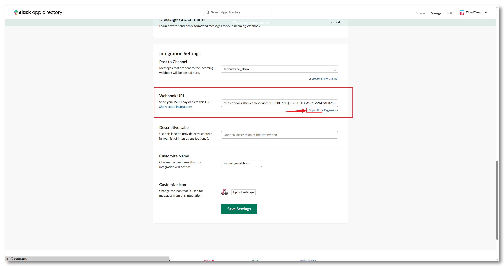
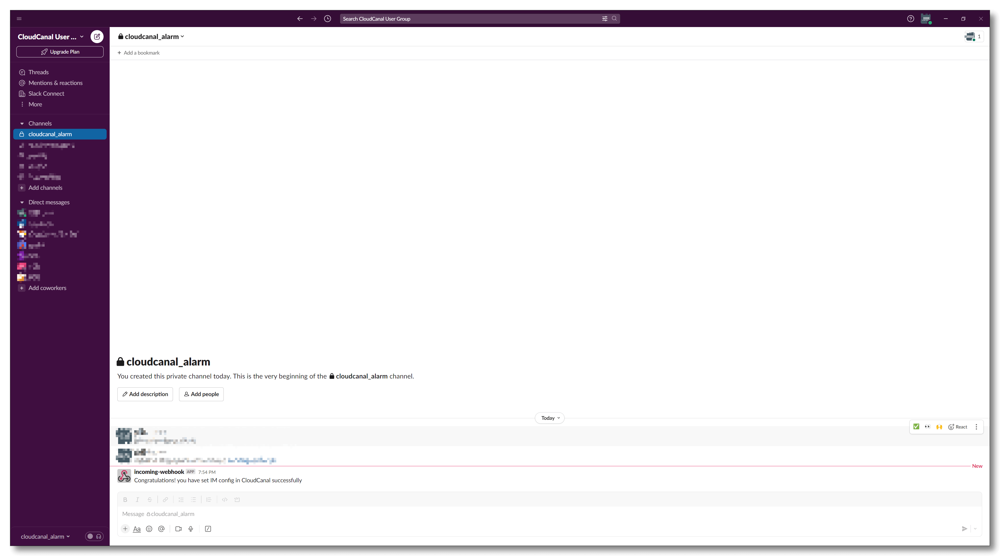

BladePipe integrates with the **Incoming WebHook** application on Slack channels by configuring the webhook to send alert messages to specified Slack channels. This document provides a brief introduction on how to obtain a valid webhook for use.

### Install Slack

- [Download Slack](https://slack.com) and install it. Skip if already installed.
- Register or log in. Skip if already logged in.

### Create a Slack Channel

- Create a channel

  

- Set Visibility
  
  

### Integration Incoming WebHook App

- Add Application

  

- Search and Install Incoming WebHook

  
 
- Add to Slack

  
  
### Obtain the webhook

- Configure WebHook

  

- Get Webhook URL

  
  

### Success

- After the Slack alert group is successfully created, and the Slack webhook is filled in the BladePipe **User Avatar**>**Account**>**User Setting**, subsequent BladePipe DataJob alerts will be sent to this group.

  
