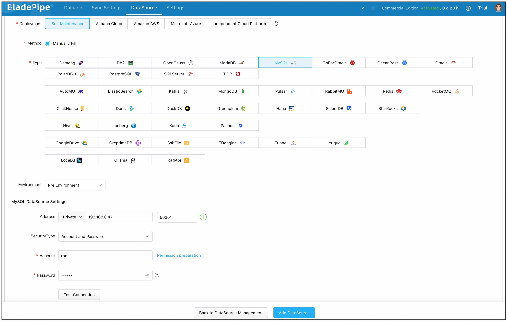
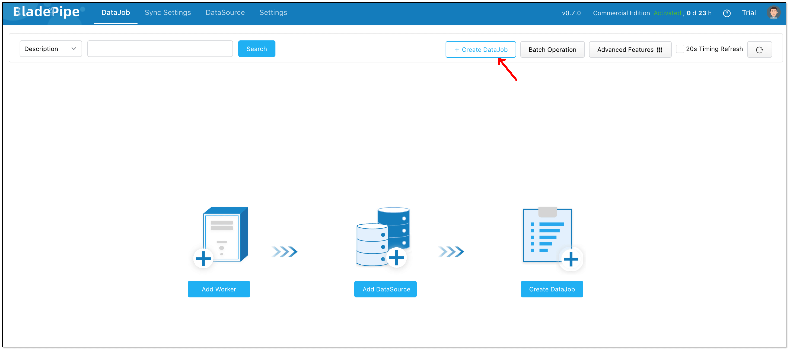
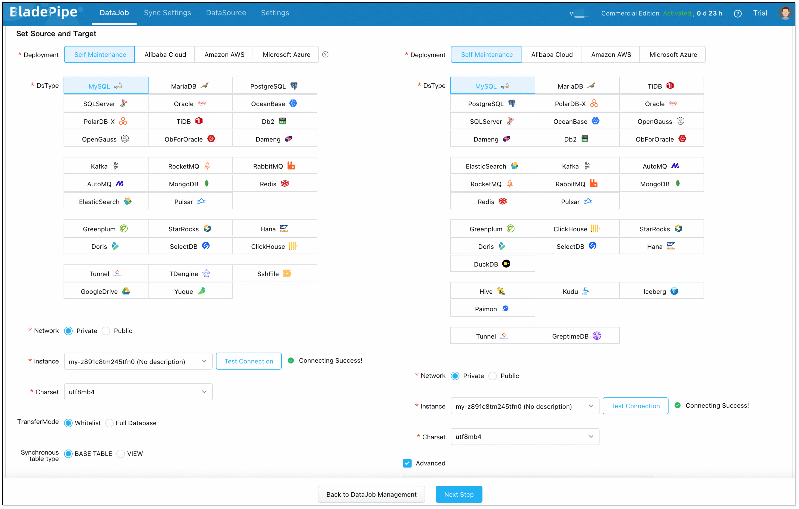
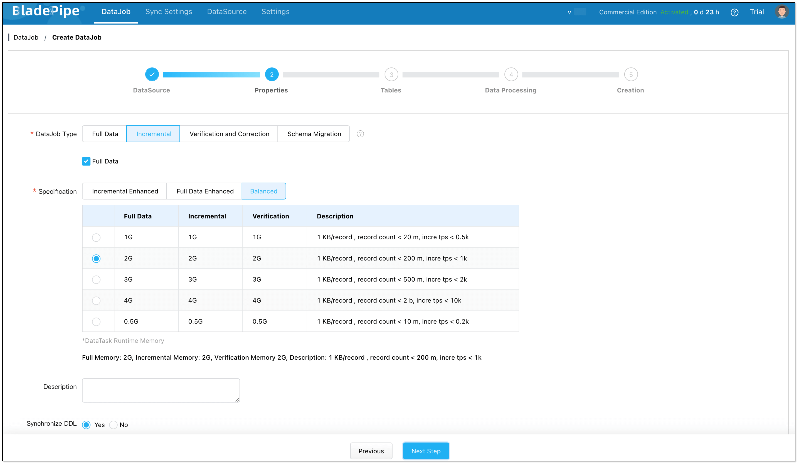
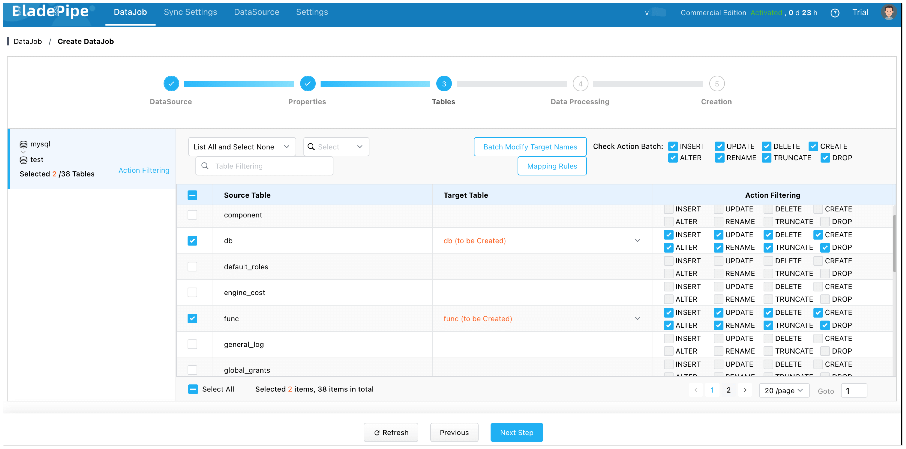
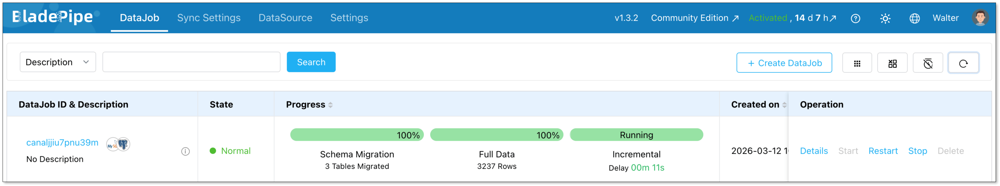

On-Premise deployment allows you to keep BladePipe and all your data in your own local environment. This page describes how to move data using **BladePipe On-Premise** in just a few steps.

## Step 1: Install BladePipe

1. Follow the instructions in [Install All-In-One (Docker)](../productOP/onPremise/installation/install_all_in_one_docker.mdx) to deploy BladePipe. You can also choose deploy BladePipe in [Kubernetes](../productOP/onPremise/installation/install_all_in_one_k8s.mdx) or [Binary](../productOP/onPremise/installation/install_all_in_one_binary.md) method.
2. Follow the instructions in [Install a Worker](../productOP/onPremise/installation/add_worker_docker.md) to add a [Worker](../intro/product_nouns.md#worker).

## Step 2: Add a DataSource
Here we use a self-managed MySQL DataSource as an example. For more details, see [Add Self-managed DataSource](../operation/datasource_manage/add_self_maintain_ds.md). For the other supported DataSources, see [Supported DataSources](../dataMigrationAndSync/datasource_version.md).
1. In the top navigation bar, click **DataSource**.
2. In the upper right corner of the page, click **Add DataSource**.
3. Configure the following information:
   - **Deployment**: Choose **Self Maintenance**.
   - **Type**: Choose the datasource type. Here we choose **[MySQL](https://www.bladepipe.com/docs/dataMigrationAndSync/connection/mysql2/)**.
   - **Address**: Fill out the endpoint to connect to the [DataSource](../intro/product_nouns.md#datasource).
   - **Account & Password**: Fill out the username and password.
4. Click **Test Connection** to verify the connection. 
5. Click **Add DataSource**.

## Step 3: Create a DataJob
Here we take a MySQL-MySQL data synchronization as an example. For more details, see [Create General DataJob](../operation/job_manage/create_job/create_full_incre_task.md).

1. In **BladePipe**, click **DataJob** in the top navigation bar.
2. In the upper right corner, click **Create DataJob**. 

3. Select the added MySQL instance as both the Source and Target, and click **Test Connection**. 
4. Choose the databases to be synchronized, and click **Next Step**. 

5. Choose **[Incremental](../intro/product_nouns.md#incremental)** as the **[DataJob](../intro/product_nouns.md#datajob)** type, and select **[Full Data](../intro/product_nouns.md#full-data)**. Then click **Next Step**. 

6. Choose the **tables** you want to sync, then click **Next Step**. 

7. Select all columns, then click **Next Step**. 

8. Click **Create DataJob**. 
9. Go to the DataJob list page to check the progress of the **DataJob**.

## Step 4: Verify the Data
1. **Insert**, **update**, and **delete** data in the source database.
2. Check whether the data in the target database is consistent with the data in the source.
