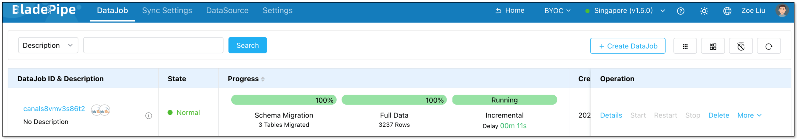

BladePipe Cloud offers two modes: [**SaaS Managed**](quick_start_mgr.md) and **BYOC**. 

The BYOC mode allows you to easily **deploy BladePipe on your own cloud infrastructure**. Follow this quickstart to configure your self-managed DataSource and create a DataJob for database replication in just a few steps.

## Step 1: Install BladePipe

To deploy a BladePipe [Worker](../intro/product_nouns.md#worker) on your infrastructure, follow the instructions in [Install Worker (Docker)](../productOP/byoc/installation/install_worker_docker.md) or [Install Worker (Binary)](../productOP/byoc/installation/install_worker_binary.md).

## Step 2: Add a DataSource

1. In the top navigation bar, click **DataSource**.
2. Click **Add DataSource**.
3. Configure the following information:
   - **Deployment**: Choose **Self Maintenance** or a cloud provider.
   - **Type**: Select your database type. 
   - **Host**: Enter the IP Address and port necessary to connect to your [DataSource](../intro/product_nouns.md#datasource).
   - **Account & Password**: Enter the username and password.
4. Click **Test Connection** to verify your database connection. 
5. Click **Add DataSource**.
   
   

## Step 3: Payment (Optional)

1. Add a payment card:
    1. Navigate to **Settings** > **Payment**.
    2. Click **Add New Card**.
    3. Enter your card information and save.
2. Subscribe to BladePipe:
    1. Navigate to **Settings** > **Payment**.
    2. Select an existing card.
    3. Click **Subscribe**.

   :::info
   - New users automatically receive a BladePipe voucher, allowing you to skip this step.
   - Once your voucher is depleted, active DataJobs will be suspended within 24 hours. To prevent any interruptions to your data integration pipelines, add a payment card and subscribe to the BladePipe service before the voucher expires.
   :::

## Step 4: Create a DataJob

1. In the top navigation bar, click **DataJob**.
2. Click **Create DataJob**. 
   
   
3. Select your added instances as the Source and Target, click **Test Connection**, and then click **Next**.
   
    
4. Choose **[Incremental](../intro/product_nouns.md#incremental)** as the **[DataJob](../intro/product_nouns.md#datajob)** type, and select **Initial Load**. Click **Next**. 
   
   
5. Select the tables you want to sync, and click **Next**. 
   
   
6. Select all required columns, and click **Next**. 
   
   
7. Click **Create DataJob**. 
8. Navigate to the DataJob list page to monitor the progress of your **DataJob**.
   
   

## Step 5: Verify the Data

1. Perform **insert**, **update**, and **delete** operations in your source database.
2. Verify that the changes dynamically replicate to the target database and ensure data consistency.
