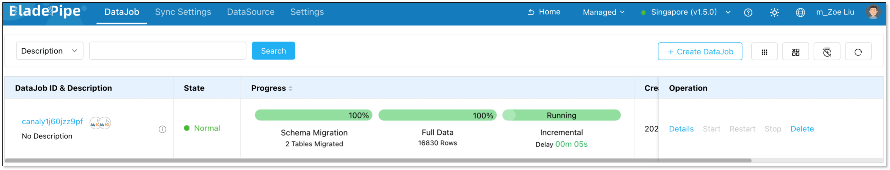

BladePipe Cloud offers two modes: **Managed** and [**BYOC**](quick_start_byoc.md). 

The Managed mode is a **cloud-hosted SaaS service** where **both the Console and the Worker are fully managed by BladePipe**. You only need to operate through the web interface. No deployment or system maintenance is required.

Follow this quickstart to create a BladePipe DataJob and run your first data synchronization task.

## Step 1: Enable Managed Mode

1. Log in to the [BladePipe SaaS Platform](https://cloud.bladepipe.com).
2. Select **Managed**.
   
   

## Step 2: Add DataSources

1. Connect your database to BladePipe Managed using one of the following methods:
   - Configure a connection using [SSH tunneling](../operation/datasource_manage/set_ssh_tunnel.md).
   - Enable public access for your data sources, navigate to **Sync Settings** > **Sync Worker** > **Machine IP List** to retrieve the worker’s IP, and add this IP to your whitelist.
   - Connect via a **Private Link** provided by your cloud service provider.
2. Return to the BladePipe Cloud platform and click **DataSource** > [**Add DataSource**](../operation/datasource_manage/add_self_maintain_ds.md). Configure the required connection details to add your source and target databases.
3. Configure the following information:
   - **Deployment**: Choose **Self Maintenance** or a cloud provider.
   - **Type**: Select your database type. 
   - **Host**: Enter the IP Address and port necessary to connect to your [DataSource](../intro/product_nouns.md#datasource).
   - **Account & Password**: Enter the username and password.
4. Click **Test Connection** to verify your database connection. 
5. Click **Add DataSource**.
   
   

## Step 3: Create a DataJob

1. Navigate to **DataJob** > [**Create DataJob**](../operation/job_manage/create_job/create_full_incre_task.md).  

   
2. Select your configured **Source** and **Target** DataSources, click **Test Connection** to verify connection, and click **Next**.  
   
   
3. Choose **[Incremental](../intro/product_nouns.md#incremental)** as the **[DataJob](../intro/product_nouns.md#datajob)** type, and select **Initial Load**. Click **Next**. 
   
   
4. Select the tables you want to sync, and click **Next**. 
   
   
5. Select the required columns, and click **Next**.   
   
   
6. Review your fully managed data pipeline configuration and click **Create DataJob**. 
   
   
7. Navigate to the DataJob list page to monitor the progress of your **DataJob**.
   
   

## Step 4: Verify the Data

1. Perform **insert**, **update**, and **delete** operations in your source database.
2. Verify that the changes dynamically replicate to the target database to ensure data consistency.