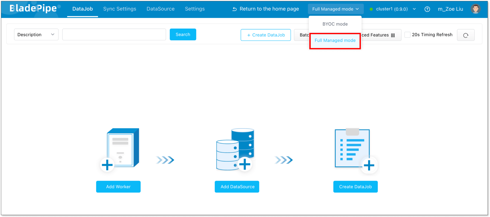
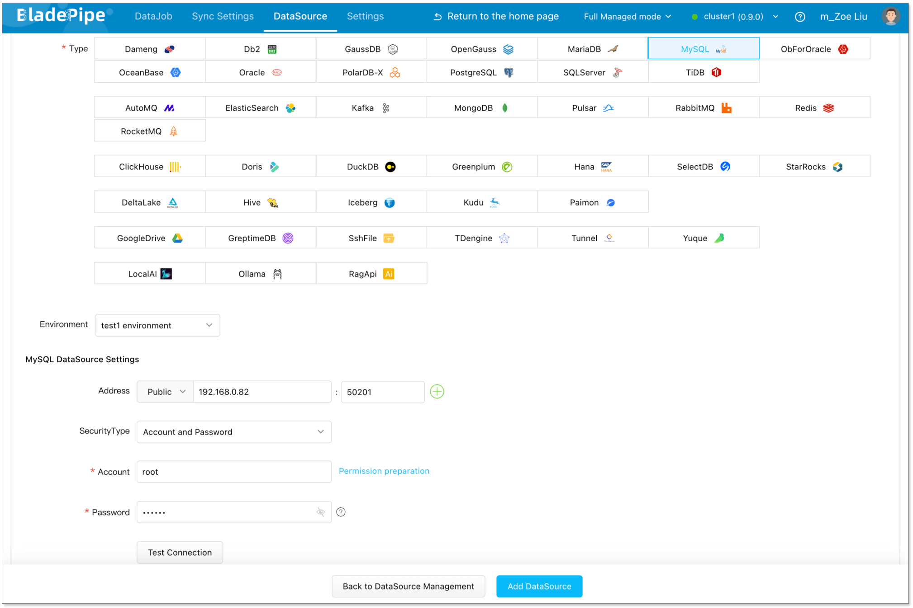
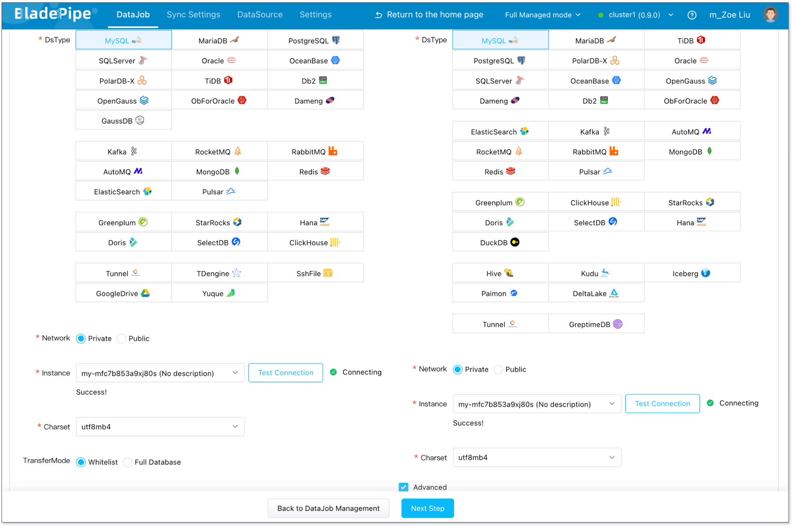
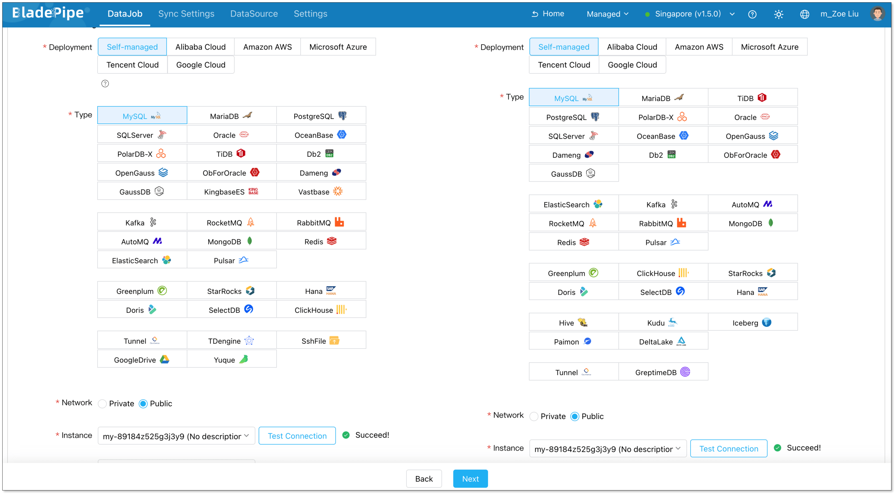
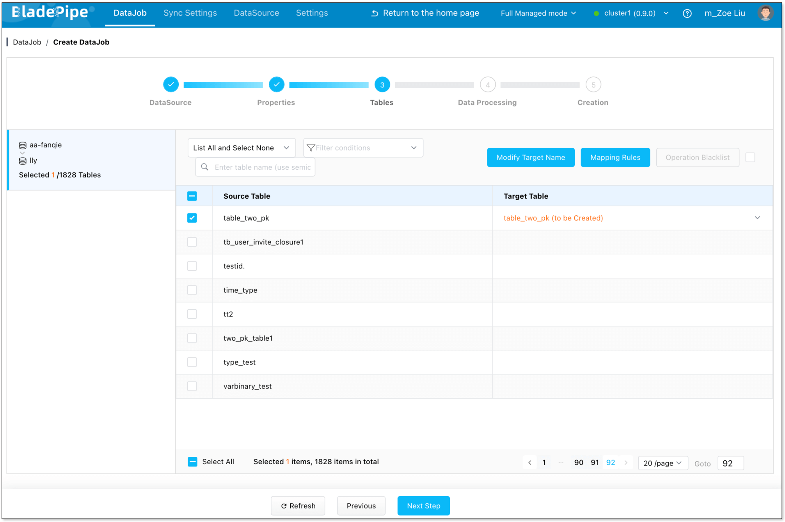
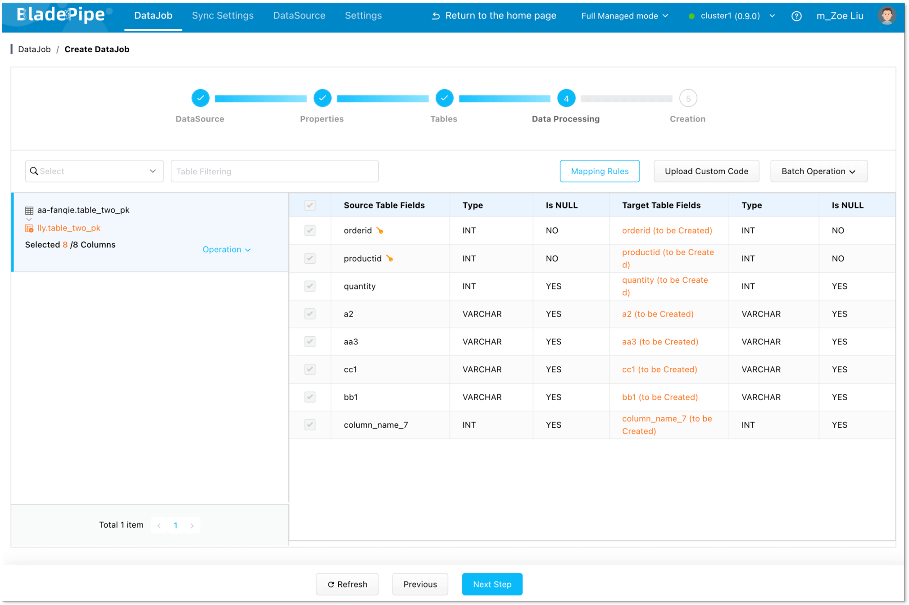
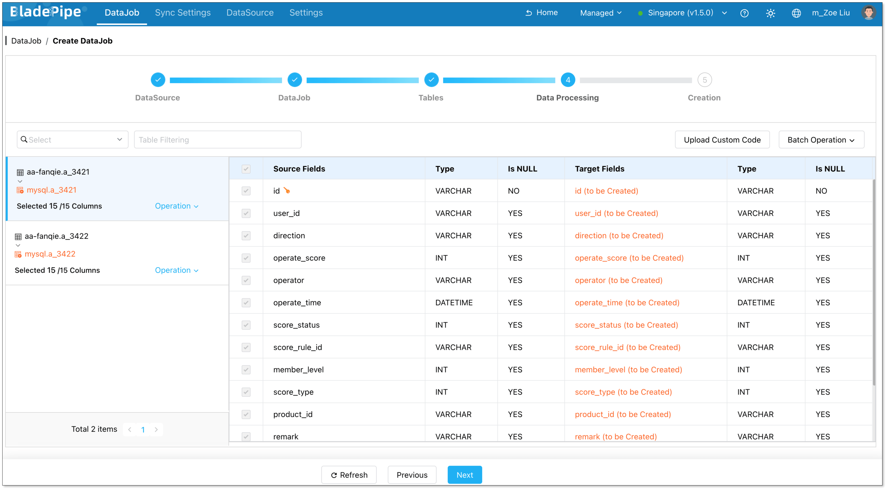
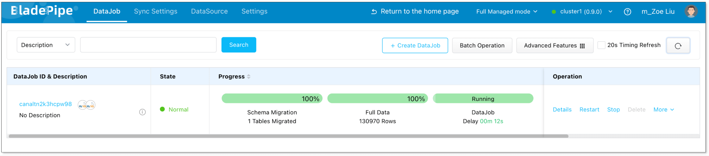

BladePipe Cloud includes two modes: Managed and BYOC. Managed is a **cloud-hosted** SaaS service, where **both the Console and the Worker are fully managed by BladePipe**. You only need to operate through the web interface. No deployment or maintenance is required.

This guide walks you through the process of quickly creating a data synchronization task.

## Step 1: Switch to Fully Managed Mode

1. Log in to the [BladePipe SaaS Platform](https://cloud.bladepipe.com).
2. In the top-right corner, switch the mode to **Fully Managed mode**.

## Step 2: Add DataSources
1. Connect BladePipe to your data sources in one of the following ways:
   - Add a data source using [SSH tunneling](../operation/datasource_manage/set_ssh_tunnel.md).
   - Enable public access for your data sources, then go to **Sync Settings** > **Sync Worker** > **Machine IP List** to get the worker’s IP and add it to your whitelist.
   - Connect via a **Private Link** provided by your cloud provider.
2. Go back to the BladePipe SaaS platform, navigate to **DataSource** > **Add DataSource**. Fill in the required connection details to add your data sources.

## Step 3: Create a DataJob
1. Go to **DataJob** > **Create DataJob**.  
2. Choose the added DataSources as your **Source** and **Target** DataSources, and click **Test Connection**. Then click **Next Step**.  

3. Choose **[Incremental](../intro/product_nouns.md#incremental)** as the **[DataJob](../intro/product_nouns.md#datajob)** type, and select **[Full Data](../intro/product_nouns.md#full-data)**. Then click **Next Step**. 

4. Choose the **tables** you want to sync, then click **Next Step**. 

5. Select all columns, then click **Next Step**.   

6. Review the DataJob configuration and click **Create DataJob**. 

7. Go to the DataJob list page to check the progress of the **DataJob**.

## Step 4: Verify the Data
1. **Insert**, **update**, and **delete** data in the source database.
2. Check whether the data in the target database is consistent with the data in the source.